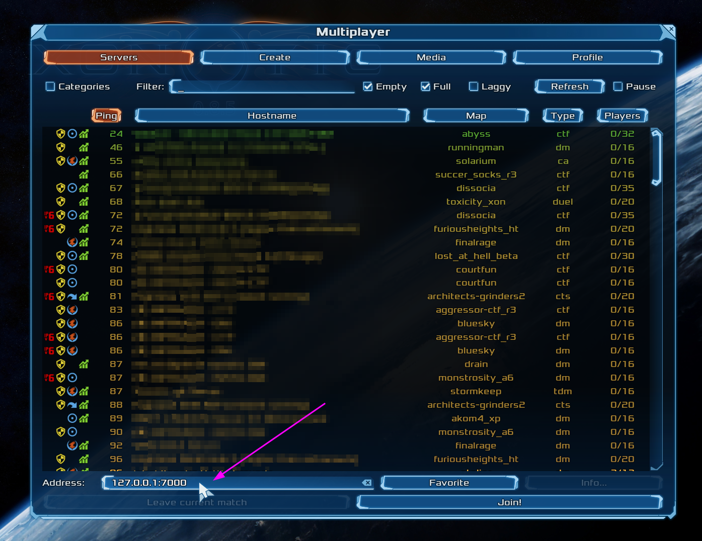

# Quickstart: Quilkin with Agones and Xonotic (xDS)

{{#include _agones.md}}
* A local copy of the [Quilkin Binary](https://github.com/googleforgames/quilkin/releases).

## 1. Overview

In this quickstart, we'll be setting up an example multi-cluster
[Xonotic](https://xonotic.org/) [Agones](https://agones.dev/) Fleet, that will
only be accessible through Quilkin, via utilising the [TokenRouter] Filter to
provide routing and access control to the Allocated `GameServer` instances.   

To do this, we'll take advantage of the Quilkin [Relay](../../services/relay.md) to provide 
an out-of-the-box multi-cluster control plane, and the [Agones Agent](../../services/agent.md)
to send information from the cluster(s) to the relay, which can be used as a
management server for the load balancers.


## 2. Install Quilkin Agones Relay

To install Quilkin as an Agones integrated xDS control plane, we can create a deployment of Quilkin running as
`quilkin manage agones`, with the appropriate permissions.

## 2. Install Quilkin Agones xDS Provider

To install Quilkin as an Agones integrated xDS control plane, we can create a deployment of Quilkin running as
`quilkin manage agones`, with the appropriate permissions.

Run the following:

```shell
kubectl apply -f https://raw.githubusercontent.com/googleforgames/quilkin/{{GITHUB_REF_NAME}}/examples/agones-xonotic-xds/xds-control-plane.yaml
```

This applies several resources to your cluster:

1. A [ConfigMap] with a [Capture] and [TokenRouter] Filter set up to route packets to Endpoints, to be the base 
   configuration for all the Quilkin proxies.
2. Appropriate [RBAC](https://kubernetes.io/docs/reference/access-authn-authz/rbac/) permissions for the 
   `quilkin manage agones` process to inspect Agones resources.
3. A matching [Deployment](https://kubernetes.io/docs/concepts/workloads/controllers/deployment/)  that runs the 
   `quilkin relay` process, a deployment for the `quilkin agent` process and a
   [Service](https://kubernetes.io/docs/concepts/services-networking/service/) that the Quilkin proxies can connect to,
   to get their Filter and Endpoint configuration from.

Now we can run `kubectl get pods` until we see that the Pod for the Deployment is up and running.

```shell
$ kubectl get pods
NAME                                    READY   STATUS    RESTARTS   AGE
quilkin-manage-agones-54b787654-9dbvp   1/1     Running   0          76s
```

We can now run `kubectl get service quilkin-manage-agones` and see the
service that is generated in front of the above Deployment for our Quilkin proxies to connect to and receive their 
configuration information from.

```shell
$ kubectl get service quilkin-manage-agones
NAME                    TYPE        CLUSTER-IP    EXTERNAL-IP   PORT(S)   AGE
quilkin-manage-agones   ClusterIP   10.104.2.72   <none>        80/TCP    1m23s
```

## 3. Install Quilkin Proxy Pool

To install the Quilkin Proxy pool which connects to the above xDS provider, we can create a Deployment of Quilkin 
proxy instances that point to the aforementioned Service, like so:

```shell
kubectl apply -f https://raw.githubusercontent.com/googleforgames/quilkin/{{GITHUB_REF_NAME}}/examples/agones-xonotic-xds/proxy-pool.yaml
```

This will set up three instances of Quilkin running as `quilkin proxy --management-server http://quilkin-manage-agones:80` 
all connected to the `quilkin-manage-agones` service.

Now we can run `kubectl get pods` until we see that the Pods for the proxy Deployment is up and running.

```shell
$ kubectl get pods                                                                                                          
NAME                                    READY   STATUS    RESTARTS   AGE
quilkin-manage-agones-54b787654-9dbvp   1/1     Running   0          5m7s
quilkin-proxies-78965c446d-dqvjg        1/1     Running   0          6s
quilkin-proxies-78965c446d-fr6zs        1/1     Running   0          6s
quilkin-proxies-78965c446d-m4rr7        1/1     Running   0          6s
```

Let's take this one step further, and check the configuration of the proxies that should have come from the `quilkin 
manage agones` instance.

In another terminal, run:  `kubectl port-forward deployments/quilkin-proxies 8000`, to port forward the
[admin endpoint](../admin.md) locally, which we can then query.

Go back to your original terminal and run `curl -s http://localhost:8000/config` 

> If you have [jq](https://stedolan.github.io/jq/) installed, run `curl -s http://localhost:8000/config | jq` for a
> nicely formatted JSON output.

```shell
$ curl -s http://localhost:8000/config
{"admin":{"address":"0.0.0.0:8000"},"clusters":{},"filters":[{"name":"quilkin.filters.capture.v1alpha1.Capture","config":{"metadataKey":"quilkin.dev/capture","suffix":{"size":3,"remove":true}}},{"name":"quilkin.filters.token_router.v1alpha1.TokenRouter","config":null}],"id":"quilkin-proxies-78965c446d-dqvjg","management_servers":[{"address":"http://quilkin-manage-agones:80"}],"port":7000,"version":"v1alpha1","maxmind_db":null}%       
```

This shows us the current configuration of the proxies coming from the xDS server created via `quilkin manage 
agones`. The most interesting part that we see here, is that we have a matching set of 
[Filters](../../services/proxy/filters.md) that are found in the `ConfigMap` in the 
[xds-control-plane.yaml](https://github.com/googleforgames/quilkin/blob/{{GITHUB_REF_NAME}}/examples/agones-xonotic-xds/xds-control-plane.yaml)
we installed earlier.

## 4. Create the Agones Fleet

Now we will create an [Agones Fleet](https://agones.dev/site/docs/reference/fleet/) to spin up all our Xonotic 
game servers.

Thankfully, Agones Fleets require no specific configuration to work with Quilkin proxies, so this yaml is a 
[standard Agones Fleet configuration](https://github.com/googleforgames/quilkin/blob/{{GITHUB_REF_NAME}}/examples/agones-xonotic-xds/fleet.yaml)

```shell
kubectl apply -f https://raw.githubusercontent.com/googleforgames/quilkin/{{GITHUB_REF_NAME}}/examples/agones-xonotic-xds/fleet.yaml
```

Run `kubectl get gameservers` until all the `GameServer` records show that they are `Ready` and able to take players.

```shell
$ kubectl get gameservers
NAME                  STATE   ADDRESS         PORT   NODE                               AGE
xonotic-d7rfx-55j7q   Ready   34.168.170.51   7226   gke-agones-default-534a3f8d-ifpc   34s
xonotic-d7rfx-nx7xr   Ready   34.168.170.51   7984   gke-agones-default-534a3f8d-ifpc   34s
xonotic-d7rfx-sn5d6   Ready   34.168.170.51   7036   gke-agones-default-534a3f8d-ifpc   34s
```

## 5. Allocate a `GameServer`

To let the Quilkin xDS provider know what token will route to which `GameServer` we need to apply the
`quilkin.dev/tokens` annotation to an allocated `GameServer`, with the token content as its value.

>  This token would normally get generated by some kind of  player authentication service and passed to the client
>  via the matchmaking service - but for demonstrative purposes, we've hardcoded it into the example 
> `GameServerAllocation`.

Since you can add annotations to `GameServers` at 
[allocation time](https://agones.dev/site/docs/reference/gameserverallocation/), we can both allocate a `GameServer` 
and apply the annotation at the same time!

```shell
kubectl create -f https://raw.githubusercontent.com/googleforgames/quilkin/{{GITHUB_REF_NAME}}/examples/agones-xonotic-xds/gameserverallocation.yaml
```

If we check our `GameServers` now, we should see that one of them has moved to the `Allocated` state, marking it as 
having players playing on it, and therefore it is protected by Agones until the game session ends.

```shell
$ kubectl get gs
NAME                  STATE       ADDRESS         PORT   NODE                               AGE
xonotic-d7rfx-55j7q   Allocated   34.168.170.51   7226   gke-agones-default-534a3f8d-ifpc   23m
xonotic-d7rfx-nx7xr   Ready       34.168.170.51   7984   gke-agones-default-534a3f8d-ifpc   23m
xonotic-d7rfx-sn5d6   Ready       34.168.170.51   7036   gke-agones-default-534a3f8d-ifpc   23m
```

> Don't do this more than once, as then multiple allocated `GameServers` will have the same routing token!

If we `kubectl describe gameserver <allocated-gameserver>` and have a look at the annotations section, we 
should see something similar to this:

```shell
$ kubectl describe gameserver xonotic-d7rfx-55j7q
Name:         xonotic-d7rfx-55j7q
Namespace:    default
Labels:       agones.dev/fleet=xonotic
              agones.dev/gameserverset=xonotic-h5cfn
Annotations:  agones.dev/last-allocated: 2022-12-19T22:59:22.099818298Z
              agones.dev/ready-container-id: containerd://7b3d9e9dbda6f2e0381df7669f6117bf3e54171469cfacbce2670605a61ce4b8
              agones.dev/sdk-version: 1.24.0
              quilkin.dev/tokens: NDU2
API Version:  agones.dev/v1
Kind:         GameServer
...
```

Where we can see that there is now an annotation of `quilkin.dev/tokens` with the base64 encoded version of `456` as 
our authentication and routing token ("NDU2").

> You should use something more cryptographically random than `456` in your application.

Let's run `curl -s http://localhost:8000/config` again, so we can see what has changed!

```shell
$ curl -s http://localhost:8000/config
{"admin":{"address":"0.0.0.0:8000"},"clusters":{"default":{"localities":[{"locality":null,"endpoints":[{"address":"34.168.170.51:7226","metadata":{"quilkin.dev":{"tokens":["NDU2"]}}}]}]}},"filters":[{"name":"quilkin.filters.capture.v1alpha1.Capture","config":{"metadataKey":"quilkin.dev/capture","suffix":{"size":3,"remove":true}}},{"name":"quilkin.filters.token_router.v1alpha1.TokenRouter","config":null}],"id":"quilkin-proxies-78965c446d-tfgsj","management_servers":[{"address":"http://quilkin-manage-agones:80"}],"port":7000,"version":"v1alpha1","maxmind_db":null}%
```

Looking under `clusters` > `localities` > `endpoints` we can see an address and token that matches up with the 
`GameServer` record we created above!

The xDS process saw that allocated `GameServer`, turned it into a Quilkin `Endpoint` and applied the set routing 
token appropriately -- without you having to write a line of xDS compliant code! 

## Connecting Client Side

Instead of connecting to Xonotic or an Agones `GameServer` directly, we'll want to grab the IP and exposed port of
the `Service` that fronts all our Quilkin proxies and connect to that instead -- but we'll have to append our 
routing token `456` from before, to ensure our traffic gets routed to the correct Xonotic `GameServer` address.

Run `kubectl get service quilkin-proxies` to get the `EXTERNAL-IP` of the Service you created. 

```shell
$ kubectl get service quilkin-proxies
NAME              TYPE           CLUSTER-IP    EXTERNAL-IP     PORT(S)          AGE
quilkin-proxies   LoadBalancer   10.109.0.12   35.246.94.14    7000:30174/UDP   3h22m
```

We have a [Quilkin config yaml](https://github.com/googleforgames/quilkin/blob/{{GITHUB_REF_NAME}}/examples/agones-xonotic-xds/client-token.yaml)
file all ready for you, that is configured to append the routing token `456` to each 
packet that passes through it, via the power of a 
[ConcatenateBytes](../../services/proxy/filters/concatenate_bytes.md) Filter.

Download `client-token.yaml` locally, so you can edit it:

```shell
curl https://raw.githubusercontent.com/googleforgames/quilkin/{{GITHUB_REF_NAME}}/examples/agones-xonotic-xds/client-token.yaml --output client-token.yaml  
```

We then take the EXTERNAL-IP and port from the `quilkin-proxies` service, and replace the`${LOADBALANCER_IP}`
with it in `client-token.yaml`.

Run this edited configuration locally with your quilkin binary as `quilkin -c ./client-token.yaml proxy`:

```shell
$ quilkin -c ./client-token.yaml proxy
{"timestamp":"2022-10-07T22:10:47.257635Z","level":"INFO","fields":{"message":"Starting Quilkin","version":"0.4.0-dev","commit":"c77260a2526542c564829a2c66935c60f00adcd2"},"target":"quilkin::cli"}
{"timestamp":"2022-10-07T22:10:47.258273Z","level":"INFO","fields":{"message":"Starting","port":7000,"proxy_id":"markmandel45"},"target":"quilkin::proxy"}
{"timestamp":"2022-10-07T22:10:47.258321Z","level":"INFO","fields":{"message":"Starting admin endpoint","address":"[::]:9092"},"target":"quilkin::admin"}
{"timestamp":"2022-10-07T22:10:47.258812Z","level":"INFO","fields":{"message":"Quilkin is ready"},"target":"quilkin::proxy"}
```

Now connect to the local client proxy on "127.0.0.1:7000" via the "Multiplayer > Address" field in the
Xonotic client, and Quilkin will take care of appending the routing token to all your UDP packets, which the Quilkin
proxies will route to the Allocated GameServer, and you can play a gamee!



...And you didn't have to change the client or the dedicated game server 🤸

## What's Next?

* Check out the variety of [Filters](../../services/proxy/filters.md) that are possible with Quilkin.
* Read into the [xDS Management API](../../services/xds.md).

[ConfigMap]: https://kubernetes.io/docs/concepts/configuration/configmap/
[Capture]: ../../services/proxy/filters/capture.md
[TokenRouter]: ../../services/proxy/filters/token_router.md
