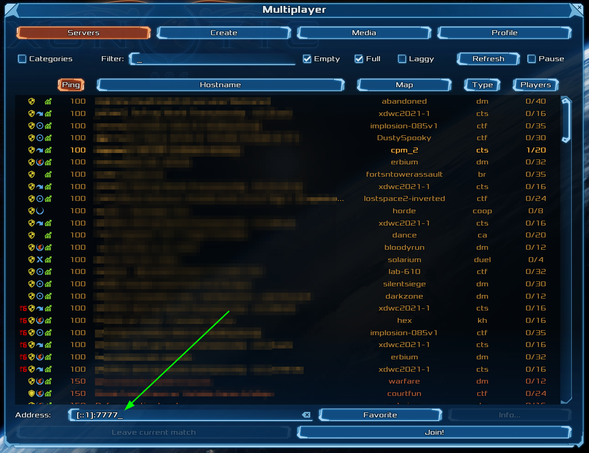

# Quickstart: Quilkin with Agones and Xonotic (Sidecar)

{{#include _agones.md}}

## 1. Agones Fleet with Quilkin

In this step, we're going to set up a Xonotic dedicated game server, with Quilkin running as a
[sidecar](../examples.md#server-proxy-as-a-sidecar), which will give us access to all the
[metrics](../../services/proxy/metrics.md) that Quilkin provides.

```shell
kubectl apply -f https://raw.githubusercontent.com/googleforgames/quilkin/{{GITHUB_REF_NAME}}/examples/agones-xonotic-sidecar/sidecar.yaml
```

This applies two resources to your cluster:

1. A Kubernetes [ConfigMap](https://kubernetes.io/docs/concepts/configuration/configmap/) with a basic Quilkin
   static configuration.
2. An Agones [Fleet specification](https://agones.dev/site/docs/reference/fleet/) with Quilkin running as a sidecar
   to Xonotic, such that it can process all the UDP traffic and pass it to the Xonotic dedicated game server.

Now you can run `kubectl get gameservers` until all your Agones `GameServers` are marked as `Ready` like so:

```shell
$ kubectl get gameservers
NAME                          STATE   ADDRESS         PORT   NODE                                    AGE
xonotic-sidecar-htc2x-84mzm   Ready   34.94.107.201   7533   gke-agones-default-pool-0f7d8adc-7w3c   7m25s
xonotic-sidecar-htc2x-sdp4k   Ready   34.94.107.201   7599   gke-agones-default-pool-0f7d8adc-7w3c   7m25s
```

## 2. Play Xonotic!

Usually with Agones you would
[Allocate](https://agones.dev/site/docs/getting-started/create-fleet/#4-allocate-a-game-server-from-the-fleet) a
`GameServer`, but we'll skip this step for this example.

Choose one of the listed `GameServer`s from the previous step, and connect to the IP and port of the Xonotic
server via the "Multiplayer > Address" field in the Xonotic client in the format of {IP}:{PORT}.



You should now be playing a game of Xonotic against 4 bots!

## 3. Check out the metrics

Let's take a look at some metrics that Quilkin outputs.

Grab the name of the GameServer you connected to before, and replace the `${gameserver}` value below, and run the
command. This will forward the [admin](../admin.md) interface to localhost.

```shell
kubectl port-forward ${gameserver} 8000
```

Then open a browser to [http://localhost:8000/metrics](http://localhost:9091/metrics) to see the
[Prometheus](https://prometheus.io/) metrics that Quilkin exports.

## 5. Cleanup

Run the following to delete the Fleet and the accompanying ConfigMap:

```shell
kubectl delete -f  https://raw.githubusercontent.com/googleforgames/quilkin/{{GITHUB_REF_NAME}}/examples/agones-xonotic-sidecar/sidecar.yaml
```

## 6. Play Xonotic, through Quilkin

Note: compression has been removed.

What we will do in this step, is run Quilkin locally as a client-side proxy to compress the UDP data before it is
sent up to our Xonotic servers that are expecting compressed data.

First, grab a copy of the Quilkin configuration
<a href="https://github.com/googleforgames/quilkin/blob/{{GITHUB_REF_NAME}}/examples/agones-xonotic-sidecar/sidecar-compress.yaml">client-compress.yaml</a>
locally. This has the Compress filter already configured, but we need to fill in the address to connect to.

> Rather than editing a file, this could also be sent through the [xDS API](../../services/xds.md), but it is easier to
> demonstrate this functionality through a static configuration.

Instead of connecting Xonotic directly, take the IP and port from one of the Agones hosted `GameServer` records, and
replace the `${GAMESERVER_IP}` and `${GAMESERVER_PORT}` values in your copy of `client-compress.yaml`.

Run this configuration locally as:

```shell
quilkin -c ./client-compress.yaml proxy
```

Now we can connect to the local client proxy on "127.0.0.1:7777" via the "Multiplayer > Address" field in the
Xonotic client, and Quilkin will take care of compressing the data for you without having to change the game
client!

Congratulations! You are now using Quilkin to manipulate the game client to server connection, without having to
edit either!

## 7. Cleanup

Run the following to delete the Fleet and the accompanying ConfigMap:

```shell
kubectl delete -f https://raw.githubusercontent.com/googleforgames/quilkin/{{GITHUB_REF_NAME}}/examples/agones-xonotic-sidecar/sidecar-compress.yaml
```

## What's Next?

* Have a look at the [examples](https://github.com/googleforgames/quilkin/blob/{{GITHUB_REF_NAME}}/examples) folder for configuration and usage examples.
