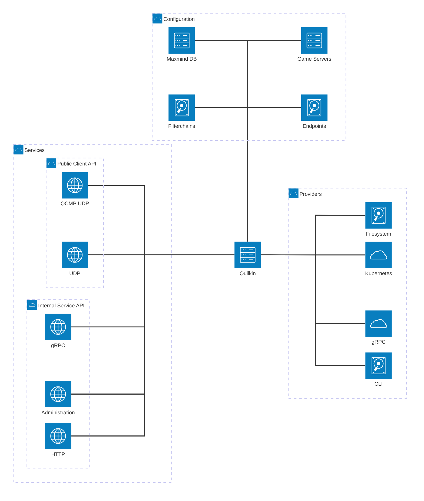

# Overview

Quilkin is a UDP proxy, specifically designed for use with multiplayer dedicated game servers.

## What is Quilkin?

Quilkin on open source is a non-transparent UDP proxy specifically designed for use with large scale multiplayer
dedicated game servers deployments, to ensure security, access control, telemetry data, metrics and more.

It is designed to be used behind game clients as well as in front of dedicated game servers.

Quilkin's aim is to pull the above functionality out of bespoke, monolithic dedicated game servers and clients, and
provide standard, composable modules that can be reused across a wide set of multiplayer games, so that game
developers can instead focus on their game specific aspects of building a multiplayer game.

## Why use Quilkin?

Some of Quilkin's advantages:

* Lower development and operational costs for securing, monitoring and making reliable multiplayer game servers and
  their communications.
* Provide entry-point redundancy for your game clients to connect to - making it much harder to take down your game
  servers.
* Multiple integration patterns, allowing you to choose the level of integration that makes sense for your
  architecture.
* Remove non-game specific computation out of your game server's processing loop - and save that precious CPU for
  your game simulation!

## Major Features

Quilkin incorporates these abilities:

* Non-transparent proxying of UDP data, the internal state of your game architecture is not visible to bad actors.
* Out of the box metrics for UDP packet information.
* Composable tools for access control and security.
* Able to be utilised as a standalone binary, with no client/server changes required or as a Rust library
  depending on how deep an integration you wish for your system.
* Integration with Game Server hosting platforms such as [Agones](https://agones.dev).
* Can be integrated with C/C++ code bases via FFI.

## Quilkin Architecture

Quilkin is broken up into three main components

* **Providers** are data collection sources to enable quilkin to see its environment.
* **Services** provide the the core business logic for handling UDP traffic as well meta control-plane functionality.
* **Configuration** controls what a given instance is able to do, what services it runs, and providers it pulls from.



## What Next?

Quilkin provides a variety of different services depending on your use-case.
The primary service is [`proxy`](./services/proxy.md), which runs a reverse UDP
proxy. To see a basic usage of the command-line interface run through the
[netcat with Quilkin quickstart](./deployment/quickstarts/netcat.md). 

For more advanced usage, you might also be interested in:

* Checking out the [installation guide](./installation.md)
* Having a look at the [example projects](https://github.com/googleforgames/quilkin/blob/{{GITHUB_REF_NAME}}/examples) for basic configuration examples.
* Checking out the [example deployment architecture](./deployment/examples.md)
  for deploying quilkin for your game network.


```shell
$ quilkin --help
{{#include ../../target/quilkin.commands}}
```

[log-docs]: https://docs.rs/env_logger/0.9.0/env_logger/#enabling-logging
