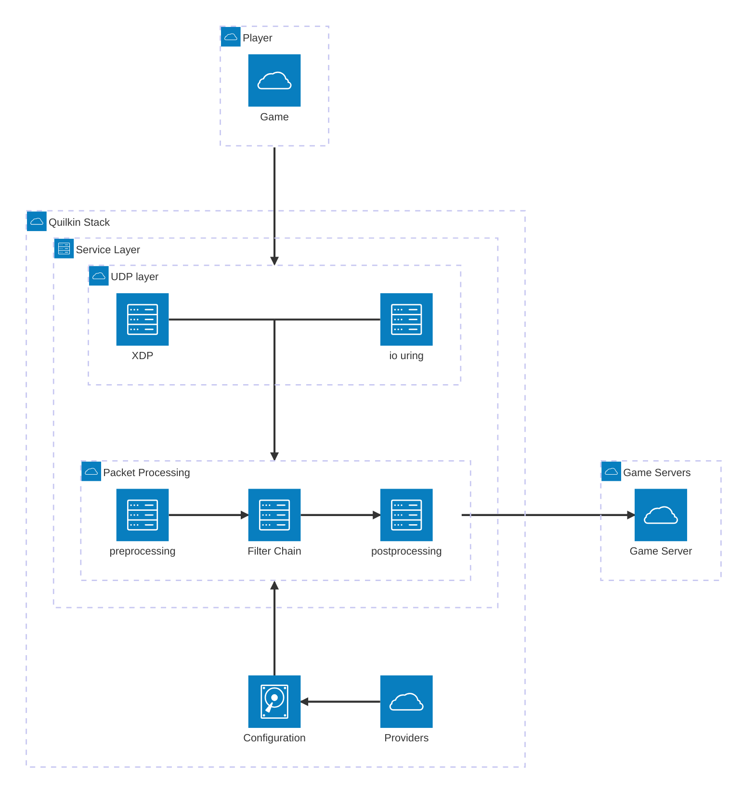

# Proxy

| Services | Ports | Protocol           |
|----------|-------|--------------------|
| Proxy    | 7777  | UDP (IPv4 OR IPv6) |
| QCMP     | 7600  | UDP (IPv4 OR IPv6) |

"Proxy" is the primary Quilkin service, which acts as a non-transparent UDP
proxy.

## Endpoints

An Endpoint represents an address that Quilkin forwards packets to that it has received from the
source port.

It is represented by an IP address and port. An Endpoint can optionally be associated with an arbitrary set of
[metadata](#endpoint-metadata) as well.

## Proxy Filters

Filters are the way for a Quilkin proxy to intercept UDP packet traffic from the
source and [Endpoints][Endpoint] in either direction, and be able to inspect,
manipulate, and route the packets as desired.

See [Filters]  for a deeper dive into Filters, as well as the list of build in Filters that come with
Quilkin.

## Endpoint Metadata

Endpoint metadata is an arbitrary set of key value pairs that are associated with an Endpoint.

These are visible to Filters when processing packets and can be used to provide more context about endpoints (e.g
whether or not to route a packet to an endpoint). Keys must be of type string otherwise the configuration is rejected.

Metadata associated with an endpoint contain arbitrary key value pairs which [Filters] can consult when processing packets (e.g they can contain information that determine whether or not to route a particular packet to an endpoint).

### Specialist Endpoint Metadata

Access tokens that can be associated with an endpoint are simply a special piece of metadata well known to Quilkin
and utilised by the built-in [TokenRouter] filter to route packets.

Such well known values are placed within an object in the endpoint metadata, under the special key `quilkin.dev`.
Currently, only the `tokens` key is in use.

As an example, the following shows the configuration for an endpoint with its metadata:
```yaml
clusters:
  - endpoints:
    - address: 127.0.0.1:26000
      metadata:
        canary: false
        quilkin.dev: # This object is extracted by Quilkin and is usually reserved for built-in features
            tokens:
            - MXg3aWp5Ng== # base64 for 1x7ijy6
            - OGdqM3YyaQ== # base64 for 8gj3v2i
```

An endpoint's metadata can be specified alongside the endpoint in [static configuration][file-configuration] or using the [xDS endpoint metadata][xds-endpoint-metadata] field when using [dynamic configuration][dynamic-configuration-doc] via xDS.

## Session

A session represents ongoing communication flow between a client on a [Local Port] and an [Endpoint].

Quilkin uses the "Session" concept to track traffic flowing through the proxy between any client-server pair. A
Session serves the same purpose, and can be thought of as a lightweight version of a `TCP` session in that, while a
TCP session requires a protocol to establish and teardown:

- A Quilkin session is automatically created upon receiving the first packet from a client via the [Local Port] to be
  sent to an upstream [Endpoint].
- The session is automatically deleted after a period of inactivity (where no packet was sent between either
  party) - currently 60 seconds.

A session is identified by the 4-tuple `(client IP, client Port, server IP, server Port)` where the client is the
downstream endpoint which initiated the communication with Quilkin and the server is one of the upstream Endpoints
that Quilkin proxies traffic to.

Sessions are established *after* the filter chain completes. The destination Endpoint of a packet is determined by
the [filter chain][Filters], so a Session can only be created after filter chain completion. For example, if the
filter chain drops all packets, then no session will ever be created.

## Diagram




[Endpoint]: #endpoints
[file-configuration]: ./proxy/configuration.md
[xds-endpoint-metadata]: https://www.envoyproxy.io/docs/envoy/latest/api-v3/config/endpoint/v3/endpoint_components.proto#envoy-v3-api-field-config-endpoint-v3-lbendpoint-metadata
[dynamic-configuration-doc]: ./xds.md
[TokenRouter]: ./proxy/filters/token_router.md
[Filters]: ./proxy/filters.md
