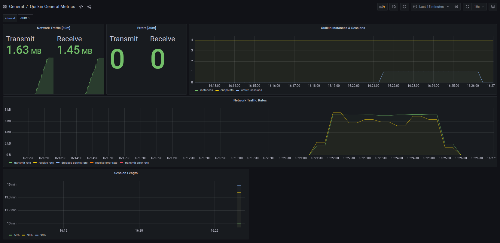

# Grafana Dashboards

This folder provides example [Grafana][grafana] dashboards for Quilkin metrics.

## Importing the dashboards

If you are hosting Grafana on a Kubernetes cluster, and have the 
[Sidecar for dashboard](https://github.com/grafana/helm-charts/blob/main/charts/grafana/README.md#sidecar-for-datasources) 
enabled, run:

`kubectl apply -f ./dashboards/` to apply all the ConfigMaps for the dashboards to your cluster into the `metrics` 
namespace. 

If you are running Grafana in an alternative environement, copy and paste the JSON from the yaml files 
into the [Import Dashboard](https://grafana.com/docs/grafana/latest/dashboards/export-import/#import-dashboard) utility.

## Makefile for convenience 

A sample [Makefile](./Makefile) with convenience targets for installing [Prometheus](https://prometheus.io/) and 
[Grafana][grafana] in a Kubernetes cluster, along with charts is also available in the [dashboards](./dashboards) 
folder.

This installs all the components in a `metrics` namespace.

Run `make setup grafana-portforward` to install everything, and forward the Grafana service to the local port 3000.

[grafana]: https://grafana.com/
